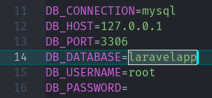
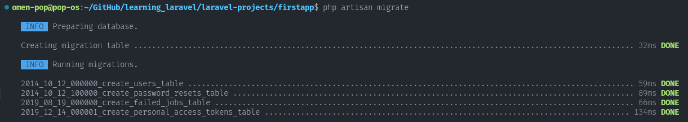
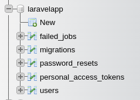
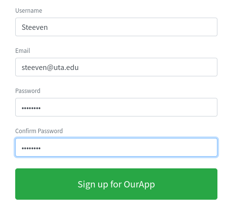
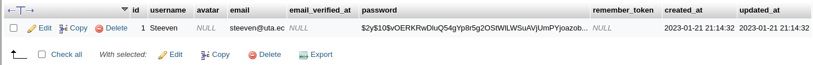

# Repository dedicated to learning Laravel.

This repository dedicated to learning Laravel, a PHP web application framework. This repository is designed to help me improve my skills and understanding of the Laravel framework.

### Resources
In this repository, one can find a variety of resources including:

- Code snippets and examples.
- Practice projects.
- Learning notes.

Text Editor used is VSCode with the following extensions:
- [PHP Namespace Resolver](https://marketplace.visualstudio.com/items?itemName=MehediDracula.php-namespace-resolver)
- [Laravel Blade Snippets](https://marketplace.visualstudio.com/items?itemName=onecentlin.laravel-blade)

#### Thinkering with php.
- To install php on linux: 
  -  `sudo apt install php8.1-cli`
- To create a local server with php run:
  - `php -S localhost:8000`> 
    > This is only for development purposes.
- Composer is a PHP dependency manager. To install composer on linux:
  - `sudo apt install composer`
  - Composer will place dependencies on the 'vendor' folder.
- Install slugify
  - `composer require cocur/slugify`
  - To import on a file use:
    - ```php
		require __DIR__ . '/vendor/autoload.php';
		use Cocur\Slugify\Slugify;
		```
- [To better understand autoloading and namespaces in PHP](daggerhartlab.com/autoloading-namespaces-php)

## Create a Laravel project
- To create a Laravel project (using composer) run:
  - `composer create-project laravel/laravel firstapp`
    - This will create a new folder called 'firstapp' with the Laravel project.
  - To start a local server for this project, from its root, run:
	 - `php artisan serve`

## Setting up routes
The /about route will return the html code, and will be accessible from the browser by typing: `localhost:8000/about`.
```php
Route::get('/', function () {
    return view('welcome');
});

Route::get('/about', function () {
    return '<h1>About Page</h1><a href="/">Back to home</a>';
});
```

### Controllers in Laravel
- To create a controller, run:
  - `php artisan make:controller ExampleController`
- Reference a controller method in a route:
  - `Route::get('/', [ExampleController::class,"homePage"]);`

## What is a view? What is the Blade template engine?
A view is a file that contains HTML code. It is used to display data to the user.
- To create a view, just create a file in the `./resources/views` folder. The name of the file must end with `.blade.php`.
  - `homePage.blade.php`
- Inside this file, only HTML code is required, but can also use php expresions. This expresions must be enclosed in double curly braces `{{}}`.
  - ```php
    <p>sum of numbers {{ 2 + 2 }}</p>
    <p>The current year is {{ date('Y') }}</p>
    ```
- To pass data to a view.
  ```php
    public function homePage() {
		//to pass data to view from controller
		$myName = 'Steeven L';
		return view(
			'homepage',
			['name' => $myName]
		);
	}
    ```
- To read data from the function on the controller, inside curly braces.
    ```php
	 <p>My name is {{ $name }}</p>
	 ```
### Reduce duplication on blade templates.
1. Using the include directive, `@include('')`.
    ```php
		@include('header')
    ```

1. Using `{{slot}}` to define a placeholder for the content.
	- /views/components/layout.blade.php
		```html
		<header>...</header>
			{{slot}}
		<footer>...</footer>
		```
	- /views/homepage.blade.php
    	- x-name_of_file
		
      ```html
		<x-layout>
			<div>... homepage content ...</div>
		</x-layout>
      ```

## Allow Laravel to access the database.
Edit the .env file to add the database credentials.


### Migrations
- To migrate laravel tables to the database, run:
  - `php artisan migrate`

    

    

### Submit form data to the database.
1. Create a route, that uses the POST method.
   ```php
	Route::post('/register', [UserController::class, "register"]);
	```
1. The form action must be the same as the first argument of the post route.
   ```html
	<form action="/register" method="POST" id="registration-form">
	```
	- The `@csfr` directive is used to prevent cross-site request forgery. It goes just afgter the openg form tag.
1. To handle the input of the user, a controller may be created. It is taken from the `Request` object passed in. Rules can also be set to validate the input.
   ```php
	$inputData = $request->validate([
			'username' => ['required', 'min:3', 'max:20', Rule::unique('users', 'username'),],
			'email' => ['required', 'email', Rule::unique('users', 'email'),],
			'password' => ['required', 'min:8', 'confirmed',],
		]);
    ```
1. To show the validation messages on the view, the `@error` directive is required. This example code will appear on the view if the validation fails, especifically for the username. It may be placed directly below the input associated with the error.
   ```php
    @error('username')
      <p class="m-0 small alert alert-danger shadow-sm">{{ $message }}</p>
    @enderror
    ```
1. To avoid, the user from having to re-type the already submitted data when an error occurs, the property 'value' can be set on the input tag. This does not work for the password input.
   ```html
      <input  value="{{old('username')}}" name="username" id="username-register" class="form-control" type="text" placeholder="Pick a username" autocomplete="off" />
	```
1. The password can be easily hashed with the method `bcrypt()` included in Laravel.
   ```php
	$inputData['password'] = bcrypt($inputData['password']);
	```
1. To send the validated data to the database, the `create()` method is used.
	```php
	User::create($inputData);
	```
|  |
| :-------------------------: |
|       |

## Laravel Authentication
### Login
1. A login route needs to be created.
   ```php
    Route::post('/login', [UserController::class, "login"]);
	```
1. A login() method on the UserController must be created to validate the input data, check the universal auth object, and if the authentication succeeds, create a cookie, to let know laravel that a user has logged in.
   ```php
    public function login(Request $request) {
		$inputData = $request->validate([
			'loginusername' => ['required',],
			'loginpassword' => ['required',],
		]);
		if (auth()->attempt([
			'username' => $inputData['loginusername'],
			'password' => $inputData['loginpassword'],
		],)) {
			$request->session()->regenerate();
			return 'congrats';
		} else {
			return 'failed';
		}
	}
	```

### Logout
1. A logout route needs to be created.
   ```php
    Route::post('/logout', [UserController::class, "logout"]);
	```
1. The logout() method on the UserController must be created to call logout on auth(). It can also redirect to the home page.
	```php
	 public function logout(Request $request) {
		auth()->logout();

		return redirect('/')->with('success', 'You have been logged out.');
	}
	```
1. When calling with() on the redirect method, the message can be accessed on the view.
	```php
	 @if (session('success'))
		<div class="alert alert-success">
		  {{ session('success') }}
		</div>
	 @endif
	```

