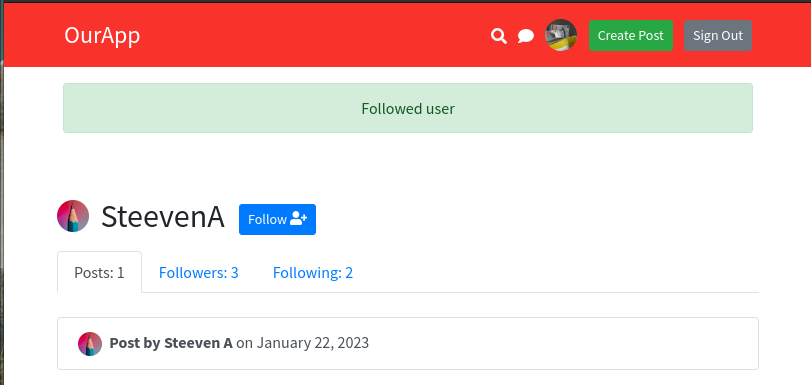

# Repository dedicated to learning Laravel.

This repository dedicated to learning Laravel, a PHP web application framework. This repository is designed to help me improve my skills and understanding of the Laravel framework.

### Resources
In this repository, one can find a variety of resources including:

- Code snippets and examples.
- Practice projects.
- Learning notes.

Text Editor used is VSCode with the following extensions:
- [PHP Namespace Resolver](https://marketplace.visualstudio.com/items?itemName=MehediDracula.php-namespace-resolver)
- [Laravel Blade Snippets](https://marketplace.visualstudio.com/items?itemName=onecentlin.laravel-blade)

#### Thinkering with php.
- To install php on linux: 
  -  `sudo apt install php8.1-cli`
- To create a local server with php run:
  - `php -S localhost:8000`> 
    > This is only for development purposes.
- Composer is a PHP dependency manager. To install composer on linux:
  - `sudo apt install composer`
  - Composer will place dependencies on the 'vendor' folder.
- Install slugify
  - `composer require cocur/slugify`
  - To import on a file use:
    - ```php
		require __DIR__ . '/vendor/autoload.php';
		use Cocur\Slugify\Slugify;
		```
- [To better understand autoloading and namespaces in PHP](daggerhartlab.com/autoloading-namespaces-php)

## Create a Laravel project
- To create a Laravel project (using composer) run:
  - `composer create-project laravel/laravel firstapp`
    - This will create a new folder called 'firstapp' with the Laravel project.
  - To start a local server for this project, from its root, run:
	 - `php artisan serve`

## Setting up routes
The /about route will return the html code, and will be accessible from the browser by typing: `localhost:8000/about`.
```php
Route::get('/', function () {
    return view('welcome');
});

Route::get('/about', function () {
    return '<h1>About Page</h1><a href="/">Back to home</a>';
});
```

### Controllers in Laravel
- To create a controller, run:
  - `php artisan make:controller ExampleController`
- Reference a controller method in a route:
  - `Route::get('/', [ExampleController::class,"homePage"]);`

## What is a view? What is the Blade template engine?
A view is a file that contains HTML code. It is used to display data to the user.
- To create a view, just create a file in the `./resources/views` folder. The name of the file must end with `.blade.php`.
  - `homePage.blade.php`
- Inside this file, only HTML code is required, but can also use php expresions. This expresions must be enclosed in double curly braces `{{}}`.
  - ```php
    <p>sum of numbers {{ 2 + 2 }}</p>
    <p>The current year is {{ date('Y') }}</p>
    ```
- To pass data to a view.
  ```php
    public function homePage() {
		//to pass data to view from controller
		$myName = 'Steeven L';
		return view(
			'homepage',
			['name' => $myName]
		);
	}
    ```
- To read data from the function on the controller, inside curly braces.
    ```php
	 <p>My name is {{ $name }}</p>
	 ```
### Reduce duplication on blade templates.
1. Using the include directive, `@include('')`.
    ```php
		@include('header')
    ```

1. Using `{{slot}}` to define a placeholder for the content.
	- /views/components/layout.blade.php
		```html
		<header>...</header>
			{{slot}}
		<footer>...</footer>
		```
	- /views/homepage.blade.php
    	- x-name_of_file
		
      ```html
		<x-layout>
			<div>... homepage content ...</div>
		</x-layout>
      ```

## Allow Laravel to access the database.
Edit the .env file to add the database credentials.


### Migrations
- To migrate laravel tables to the database, run:
  - `php artisan migrate`

    

    

### Submit form data to the database.
1. Create a route, that uses the POST method.
   ```php
	Route::post('/register', [UserController::class, "register"]);
	```
1. The form action must be the same as the first argument of the post route.
   ```html
	<form action="/register" method="POST" id="registration-form">
	```
	- The `@csfr` directive is used to prevent cross-site request forgery. It goes just afgter the openg form tag.
1. To handle the input of the user, a controller may be created. It is taken from the `Request` object passed in. Rules can also be set to validate the input.
   ```php
	$inputData = $request->validate([
			'username' => ['required', 'min:3', 'max:20', Rule::unique('users', 'username'),],
			'email' => ['required', 'email', Rule::unique('users', 'email'),],
			'password' => ['required', 'min:8', 'confirmed',],
		]);
    ```
1. To show the validation messages on the view, the `@error` directive is required. This example code will appear on the view if the validation fails, especifically for the username. It may be placed directly below the input associated with the error.
   ```php
    @error('username')
      <p class="m-0 small alert alert-danger shadow-sm">{{ $message }}</p>
    @enderror
    ```
1. To avoid, the user from having to re-type the already submitted data when an error occurs, the property 'value' can be set on the input tag. This does not work for the password input.
   ```html
      <input  value="{{old('username')}}" name="username" id="username-register" class="form-control" type="text" placeholder="Pick a username" autocomplete="off" />
	```
1. The password can be easily hashed with the method `bcrypt()` included in Laravel.
   ```php
	$inputData['password'] = bcrypt($inputData['password']);
	```
1. To send the validated data to the database, the `create()` method is used.
	```php
	User::create($inputData);
	```
|  |
| :-------------------------: |
|       |

## Laravel Authentication
### Login
1. A login route needs to be created.
   ```php
    Route::post('/login', [UserController::class, "login"]);
	```
1. A login() method on the UserController must be created to validate the input data, check the universal auth object, and if the authentication succeeds, create a cookie, to let know laravel that a user has logged in.
   ```php
    public function login(Request $request) {
		$inputData = $request->validate([
			'loginusername' => ['required',],
			'loginpassword' => ['required',],
		]);
		if (auth()->attempt([
			'username' => $inputData['loginusername'],
			'password' => $inputData['loginpassword'],
		],)) {
			$request->session()->regenerate();
			return 'congrats';
		} else {
			return 'failed';
		}
	}
	```


### Logout
1. A logout route needs to be created.
   ```php
    Route::post('/logout', [UserController::class, "logout"]);
	```
1. The logout() method on the UserController must be created to call logout on auth(). It can also redirect to the home page.
	```php
	 public function logout(Request $request) {
		auth()->logout();

		return redirect('/')->with('success', 'You have been logged out.');
	}
	```
   

1. When calling with() on the redirect method, the message can be accessed on the view.
	```php
	 @if (session('success'))
		<div class="alert alert-success">
		  {{ session('success') }}
		</div>
	 @endif
	```


## Posts
### Create a migration file for posts.
1. run `php artisan make:migration create_posts_table`

1. Modify the migration file to add the columns.
   ```php
	public function up()
		{
			Schema::create('posts', function (Blueprint $table) {
					$table->id();
					$table->timestamps();
					$table->string('title');
					$table->longText('body');
					$table->foreignId('user_id')->constrained();
			});
		}
   ```
1. run `php artisan migrate` to actually create the table on the database.

### Create a model for posts.
1. Run `php artisan make:model Post`
1. On the Post model class, under `use HasFactory`, add: `protected $fillable = ['title', 'body', 'user_id'];`, so that it can recognize the data on the array that will be passed to the create() method.

### Create a controller for posts.
1. On the BolgController, add a method to create a post. The user_id can be extracted from the auth() object.
	```php
	public function storePost(Request $request) {
		$postFields = $request->validate([
			'title' => 'required',
			'body' => 'required'
		]);
		$postFields['title'] = strip_tags($postFields['title']);
		$postFields['body'] = strip_tags($postFields['body']);
		$postFields['user_id'] = auth()->id();
		Post::create($postFields);
	}
   ```
|   |
| :----------------------: |
|  |


## Dynamic URLs (single-post)
1. To create a dynamic url, the route must be created with a parameter. Thi
	```php
	 Route::get('/post/{post}', [BlogController::class, "viewPost"]);
	```
1. The viewPost() method need to be created on the BlogController. The parameter passed to the method must match the parameter on the route, and a type must be also provided for the parameter, in this way Laravel can do argument hinting and automatically retrieve the post from the database.
   ```php
   public function viewPost(Post $post) {
		return view("single-post", ['post' => $post]);
	}
   ```
1. On the view, the post can be accessed with the variable passed to the view.
   ```php
    <h2>{{ $post->title }}</h2>
   ```
1. To retrieve models linked with a foreign key, a method can be created on the Post model.
   ```php
   public function userFromPost(){
		 return $this->belongsTo(User::class, 'user_id');
	 }
   ```
1. It can be used in the view, through the post variable passed to the view.
   ```php
   Posted by <a href="#">{{ $post->userFromPost->username }}</a>
   ```
	
1. After the post creation, a redirection can be issued, to send the user to the newly created post.
   ```php
   $newPost =	Post::create($postFields);
   return redirect("/post/{$newPost->id}")->
	  with('success', "New post created successfully");
   ```
	

## Markdown support
1. Override the body content on the post, importing Str, and using the built-in markdown() method.
   ```php
   $post['body'] = Str::markdown($post->body);
   ```
1. On the view, it es needed to allow html tags. 
   ```php
    <p>{!! $post->body !!}</p>
   ```


## Middleware
It allows to check the state of the app, to guard routes or other resources from unauthorized access. it is a layer that can modify the request or response, or even block the request.
1. To create custom middleware, run:`php artisan make:middleware customActionMiddleware`
2. To use a middleware, it must be registered on the `app/Http/Kernel.php` file.
3. To apply middleware, on tho routes, it must be called on the route object.
   ```php
   Route::post('/login', [UserController::class, "login"])->middleware('guest');
   Route::post('/logout', [UserController::class, "logout"])->middleware('auth');
   ```
## Policies for updating and deleting posts
The general idea for this is, only the author should be allowed to modify or delete the post, others  should not see or access that functionality.

1. To create a policy, run: `php artisan make:policy PostPolicy --model=Post`, using the model flag, will allow Laravel to create extra boilerplate code, that will "link" the policy with the Post model.
1. Policies are registered on the `app/Providers/AuthServiceProvider.php` file.
   ```php
	 protected $policies = [
		Post::class => PostPolicy::class,
        // 'App\Models\Model' => 'App\Policies\ModelPolicy',
    ];
	 ```
1. Policies will have several methods, that need to be modified to return a boolean value, based on on the rule the policy is based on.
   ```php
   public function update(User $user, Post $post) {
		return $user->id === $post->user_id;
	}
   ```
1. Middleware can also be used to enforce a policy. For example to onle allow deletion of posts by their respectivo authors.
   ```php
	Route::delete('/post/{post}', [BlogController::class, "deletePost"])->middleware('can:delete,post');
   ```
1. To use the policy on the view, the `@can` directive may be used.
	```php
	@can('update', $post)
		<a href="/delete" method="POST">Delete post</a>
	@endcan
   ```

## Allow "Moderation"
- To modify an already existing table, using migration, run: `php artisan make:migration add_isadmin_users_table --table=users`
- Then on the `up()` method, instruct artisan to create the column
  ```php
  $table->boolean('isAdmin')->default(false);
  ```
  The `down()` method can contain the code to reverse what is on the `up()` method.
  ```php
  $table->dropColumn('isAdmin');
  ```
- Run `php artisan migrate` to apply the changes to the database.


- Modify post policy to take into account the isAdmin status. this con be set up for both, the update() and delete() methods.
  ```php
  public function update(User $user, Post $post) {
		return $user->id === $post->user_id || $user->isAdmin;
	}
  ```

## Gates (Admins only)
Gates are a way to check if a user has a specific permission. They are not linked to a model, and can be used to check if a user has a specific permission, or if a user is an admin.
1. To define a policy, on the `app/Providers/AuthServiceProvider` class, the `Gate::define()` method can be used inside the `boot()` method.
	```php
	Gate::define('accessAdminPage', function (User $user) {
		return $user->isAdmin;
	});
	```
1. This can be used on the routes file, to protect the routes that need to be "gated".
   ```php
   Route::get(
     '/admin', [UserController::class, "adminPage"],
   )->middleware('can:accessAdminPage');
   ```
1. On the user controller class, a method to show the route must be created.

## Uploading images
1. To allow file uploads, the `enctype="multipart/form-data"` attribute must be added to the form.
	```php
	<form action="/post" method="POST" enctype="multipart/form-data">
	```
	
1. To allow the upload of files bigger than 2MB, it is neccesary to edit the php.ini file, and change the `upload_max_filesize` value.
1. Create a post route to upload the file, and a function on the controller, to configure the upload. Here the file can be validated, for example make sure is an image, or smaller that a certain size.
   ```php
	public function storeAvatar(Request $request){
		$request->validate([
			'avatar' => ['required|image|max:3000',],
		]);
		//file tag name, is the name used to retrieve that specific file. <input  name="avatar"...
		$request->file('avatar')->store('avatars');
	}
   ```
	
	> The name of the file is automatically changed by Laravel
1. To link the actual public folder of the project, with the folder Laravel stores the file, run: `php artisan storage:link`. If this is done, the avatars directory will be available directly on the browser through a linx to the files. For Laravel to save on this directory, the parameter to the sore method must change to the public directory.
	```php
	$request->file('avatar')->store('public/avatars');
	```
	
	---
	

### Resize image on server side.
1. To resize the image, the `Intervention/image` package can be used. To install it, run: `composer require intervention/image`. Then, to use this package, call make() on the Image class, and pass the file to be resized. The way the file is saved, now will be done with the Storage class, as now a rawImage is being manipulated.
	```php
	public function storeAvatar(Request $request) {
		$request->validate([
			'avatar' => 'required|image|max:3000',
		]);
		$rawImg = Image::make($request->file('avatar'))->fit(256)->encode('jpg');

		$user = auth()->user();
		$filename = $user->id . '-' . uniqid() . '.jpg';

		Storage::put('public/avatars/'.$filename, $rawImg);
	}
	```
1. **Store the path of file on database**. After saving the file, assign the the filename to the avatar property en the user, and call save() on the user.
   ```php
   $user->avatar = $filename;
   $user->save();
   ```
1. in this way the first part of the path would need to be prepended to the path provided to html tags. Like this: `src="/storage/avatars/{{auth()->user()->avatar}}"`
1. To avoid havind to do this, the path can be prepended on the model of user, this also allows to provide a fallback file, for the users where the avatar property is empty.
   ```php
	protected function avatar(): Attribute {
		return Attribute::make(get: function ($value) {
			return $value ? '/storage/avatars/' . $value : '/fallback-avatar.jpg';
		});
	}
   ```
### Delete existing avatar, when uploading a new one.
1. The value of the old avatar needs to be stored, so that it can be referenced later for deletion.  This needs to be done before the new avatar overrides the previos avatar. `$oldAvatar =$user->avatar;`
1. After the new avatar has been saved, the old avatar can be deleted.
   ```php
   if ($oldAvatar != "/fallback-avatar.jpg") {
     Storage::delete(str_replace("/storage", "public", $oldAvatar));
   }
   ```


## Follow another user functionality.
1. Create migration to add follows table. `php artisan make:migration create_follows_table`
1. The up() method would look like this:
   ```php
	public function up() {
		Schema::create('follows', function (Blueprint $table) {
			$table->id();
			$table->foreignId('user_id')->constrained();
			//create column, then sets it as foreign key of the user table on thi id column.
			$table->unsignedBigInteger('followeduser');
			$table->foreign('followeduser')->references('id')->on('users');
			
			$table->timestamps();
		});
	}
	```
1. run: `php artisan migrate`, which creates the table.

1. Create a controller to handle the follow functionality. `php artisan make:controller FollowController`
1. Create a Follow model, to handle the database interaction. `php artisan make:model Follow` 
1. On the controller create the methods for assigning and unassigning followers. When creatien the follow, enforcing rules may be desired, such as user can not follew self, and cant follow someone that one is already following.
   
	
   ---
   
   ---
   

### Stop following a user
1. The unassignFolloger() method needs to be implemented.
   ```php
	public function unassignFollower(User $user) {
		Follow::where([['user_id', '=', auth()->user()->id], ['followeduser', '=', $user->id],])->delete();
		return back()->with('success', 'Unfollowed user');
	}
	```
1. As well as the logic to show a different button.
   ```php
   @if (!$isFollowing and auth()->user()->id != $user->id)
     <!-- code -->
   @endif
   ```


## Model relationships in Laravel
1. The relationship between followers can be done in the User model class, the method would have to return the relationship.
   ```php
	public function followed() {
		return $this->hasMany(Follow::class, 'followeduser');
	}
	public function following() {
		return $this->hasMany(Follow::class, 'user_id');
	}
   ```
1. The Follow model class, can return who followed who.
   ```php
	public function userFollowing() {
		return $this->belongsTo(User::class, 'user_id');
	}
	public function userFollowed() {
		return $this->belongsTo(User::class, 'followeduser');
	}
   ```
1. On the user controller, this data would need to be passed down to the view, for instance:
   ```php
	public function profileFollowers(User $user) {
		$this->sharedProfileData($user);
		return view(
			'profile-followers',
			['followers' => $user->followed()->latest()->get(),]
		);
	}
   ```
1. On the view, on would just have to loop through the data.
   ```php
	@foreach ($followers as $follower)
		followers
			<a class="list-group-item list-group-item-action" href="/profile/{{ $follower->userFollowing->username}}">
				userFollowing->avatar }}" />
			{{$follower->userFollowing->username}}
			</a>
	@endforeach
   ```
## Homepage feed
1. Creater the relationship between the user and the post, going through the follow table.
   ```php
	public function feedPosts() {
		//arguments on te hasManyThrough:
		//1 - Table on the other side of the relationship
		//2 - Table on the middle of the relationship
		//3 - Foreign key on the middle table
		//4 - Foreign key on the other side of the relationship
		//5 - Local key on the current table
		//6 - Local key on the middle table
		return $this->hasManyThrough(Post::class, Follow::class, 'user_id', 'user_id', 'id', 'followeduser');
	}
   ```
1. Send this data, to the view.
   ```php
	return view('homepage-feed', ['posts' => auth()->user()->feedPosts()->latest()->get()]);
   ```


## Pagination in laravel
1. The pagination is done on the controller, by adding the `paginate()` method to the query. This method takes the number of items per page as an argument.
	```php
	return view('homepage-feed', ['posts' => auth()->user()->feedPosts()->latest()->paginate(4)]);
	```
1. To include links to the next and previous pages, the view needs to include `{{ $posts->links() }}`. 
1. By default Laravel uses tailwind for css, to change this for the pagination, on `/app/Providers/AppServiceProvider.php` inside the method `boot()` add: ` Paginator::useBootstrapFive();`


## Change title of the page (on the tab)
- Where the title is set, add the following code:
	```php
		<title>
		@isset($title)
			{{ $title }} | OurApp
		@else
			OurApp
		@endisset
	</title>
	```
- Then on every page that need to have a custom title, set the variable title like this:
   ```php
	<x-layout :title="$post->title">
	...
	</x-layout>
	<!-- or -->
	<x-profile :sharedData="$sharedData" title="{{ $sharedData['user']->username }}'s Profile" >
	...
	</x-profile>
	```
|  |  |
| --------------------- | --------------------- |

## Search in Laravel
This is a laravel feature, but requires composer to download. Run: `composer require laravel/scout`, then to allow laraver to use this, run: `php artisan vendor:publish --provider="Laravel\Scout\ScoutServiceProvider"`. 

- The Post model class will need to declare it uses Searcheable, and declare de function "toSearchArray()", whic returns an array that describes on which fields the searh will work on.
  ```php
  use Searchable;
   //code..
  public function toSearchArray() {
		return [
			'title' => $this->title,
			'body' => $this->body
		];
	}
  ```
- On the `.env` file, add the following: `SCOUT_DRIVER=database`

- On the BlogController, the search function needs to be implemented. 
  ```php
  public function search($term) {
		return Post::search($term)->get();
  }
  ```
## Vite setup for Laravel
1. Install nodejs, run: `sudo apt install nodejs -y`

2. Then to install the dependencies listed on package.json, run: `npm install`, if nnpm is not installed, run: `sudo apt install npm -y`

3. Copy all the contents from `public/main.css` to `resources/css/app.css`. The main.css file can now be deleted. 

4. On `resources/js/app.js` one can add the desired javascript code.

5. To use the app.css and app.js files on the project, on the `layou.blade.php` file, replace the css importation line with `@vite(['resources/css/app.css'])` and add `@vite(['resources/js/app.js'])`

6. To see the changes, run `npm run dev`.

7. The command `npm run build` will create a production version of the app on build subdirectory.

8. After copyin the `live-search.js` file to the `resources/js` import it on app.js. Run: `npm install dompurify` to install the dependency.

9. On  the `app.js` file add:
   ```javascript
   import Search from './live-search';

	//code...

   if (document.querySelector('.header-search-icon')) {
		new Search();
   }
   ```
   This will only instantiate a Search object if the search icon is present on the page.


## Broadcasting 
### Events and Listeners
- Event Listeners go on the listen method inside the `app/Providers/EventServiceProvider.php` class. For example this show code for an example event, and its listener:
  
  
  Each of these should be o a different file, Laravel can help create these files, we just need to declare where on the EventServiceProvider.php file like this:
  

  To generate these files usung Laravel run: `php artisan event:generate`
- Now thes can be used anywhere from the aap. For example, for an event to fire when logging in, on the login method, after logging in,just add:
  ```php
  //...
  event(new OurExampleEvent());
  //...
  ```
- The listener can be used to do anything, for example, to send an email when the event is fired, on the handle method of the listener, add:
  ```php
  public function handle(OurExampleEvent $event) {
	Log::debug('OurExampleEvent was fired');
  }
  ```

### Pusher
One of the default services for this on laravel is pusher. To use it [create a free account](pusher.com)

Then on the `.env` file change BROADCAST_DRIVER to pusher, and pusher configuration like bellow:
```
BROADCAST_DRIVER=pusher
 ---
PUSHER_APP_ID=123456
...
```

Then run: `composer require pusher/pusher-php-server`
- Create a route:
  ```php
    Route::post('/send-message', [ChatController::class, "sendMessage"])->middleware('auth');
  ```
- Create a controller, and on it a function to handle the request:
  ```php
    public function sendMessage(Request $request) {
		$fields = $request->validate([
			'message' => 'required',
		]);
		$message = trim(strip_tags($fields['message']));
		if (!$message) {
			return response()->noContent();
		}
		broadcast(new ChatMessage(['user' => auth()->user(), 'message' => $message]))->toOthers();
		return response()->noContent();
	}
  ```
- run: `npm install laravel-echo pusher-js`

- uncomment `App\Providers\BroadcastServiceProvider::class`, on `config/app.php`
## Send email from Laravel
1. Create a MailTrap account, and on the `.env` file add the following (change username and password accordingly):
```
MAIL_MAILER=smtp
MAIL_HOST=smtp.mailtrap.io
MAIL_PORT=2525
MAIL_USERNAME=_your-username_
MAIL_PASSWORD=_your-password_
MAIL_ENCRYPTION=tls
```
2. Create a template for the email, on `resources/views/` create a file `new-post-email.blade.php` with the following content:
```php
<div style="font-family: sans-serif;">
	 <strong>{{$data['user']->username}}</strong>, {{$data['user']->username}} is a great post!.
</div>
```
3. Run: `php artisan make:mail NewPostEmail`
4. Now we can send emails, for example, on the `PostController` class, on the `store` method, add:
```php
Mail::to(auth()->user()->email)->send(new NewPostEmail([
			'user' => auth()->user(),
			'title' => $newPost->title,
		])
); 
```
5. On the build method of the `NewPostEmail` class, add:
```php
public function build() {
	return $this->subject('Congratulations!')->view('new-post-email', ['data' => $this->data]);
}
```

## Add Job to Queue
1. Create a job by running: `php artisan make:job SendEmailJob`
1. From a function, call dispatch, and a as parameter an intance or the job class, that was just created.
```php
dispatch(new SendEmailJob([
	'user' => auth()->user(),
	'title' => $newPost->title,
]));
```
1. On the job class, make sure to receive the data on the constructor, and implement the body of the handle method:
```php
//constructor
public $incoming;
public function __construct($incoming) {
	$this->incoming = $incoming;
}
//handle method
public function handle() {
	echo $this->incoming['user']->email;
	Mail::to($this->incoming['user']->email)->send(new NewPostEmail([
		'user' => $this->incoming['user'],
		'title' => $this->incoming['title'],
	]));
}
```

1. To allow laravel to run the queue on the background, change the QUEUE_CONNECTION on the `.env` file to `database` and run: `php artisan queue:table` and `php artisan migrate`

1. To start the jobs on the queaue, run: `php artisan queue:work`


## Schedule a task
1. Create a new template with te content to display.
1. run `php artisan make:mail RecapMail`
1. On the RecapMail class, add the following:
	```php
	public function build(){
		$post=Post::count();
		$user=User::count();
		return $this->subject('Site RECAP')->view('recapmail',['postCount'=>$post,'userCount'=>$user]);
	}
	```

1. To actually schedule a task, on the `app/Console/Kernel.php` file, inside the protected method schedule, add the following:
	```php
	$schedule->call(function(){
		Mail::to('test@example.com')->send(new RecapMail());
	})->everyMinute();
	```

1. To make Laravel to start the scheduler, run: `php artisan schedule:work`

## Working with Cache on Laravel.
1. Use the cache class, for example, to cache the number of posts, on the homepage, add:
   ```php
	$postCount=Cache::remenber('postCount', 60, function(){
		return Post::count();
	});
	return view('homepage',['postCount'=>$postCount]);
	```
